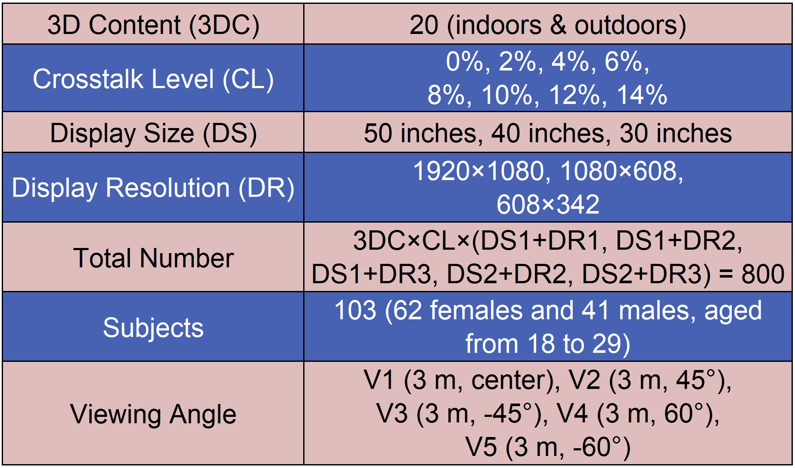
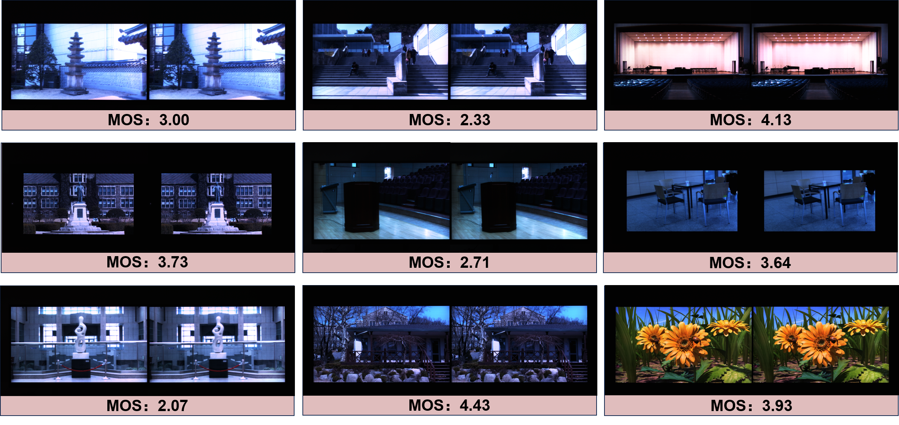

# TJU-glasses-free-3D-displays-dataset
A visual quality assessment database-oriented to the glasses-free 3D displays
# Dataset-Overview
The visual quality of the glasses-free 3D display is significantly influenced by display parameters, such as crosstalk, display resolution, display size, and so on. To investigate the impact of these display parameters on the visual quality of the glasses-free 3D display, we create the TJU glasses-free 3D displays dataset. Firstly, we simulate these display parameters in the 3D image and then input them into a single display, which simulates 800 glasses-free 3D displays with different parameters. Then, the viewers are invited to perceive these simulated glasses-free 3D displays from different viewing angles. After that, to simulate the process of human eyes imaging when watching the glasses-free 3D display, the binocular camera is set to capture the stereo views of the glasses-free 3D displays. The summary of our dataset is shown below:

  

# Sample Data
There are some samples from the TJU-glasses-free-3D-displays-dataset, which are captured through a binocular camera. 

  

# Resource
If you want to get the dataset for further study, please contact zqpan3-c@my.cityu.edu.hk.
